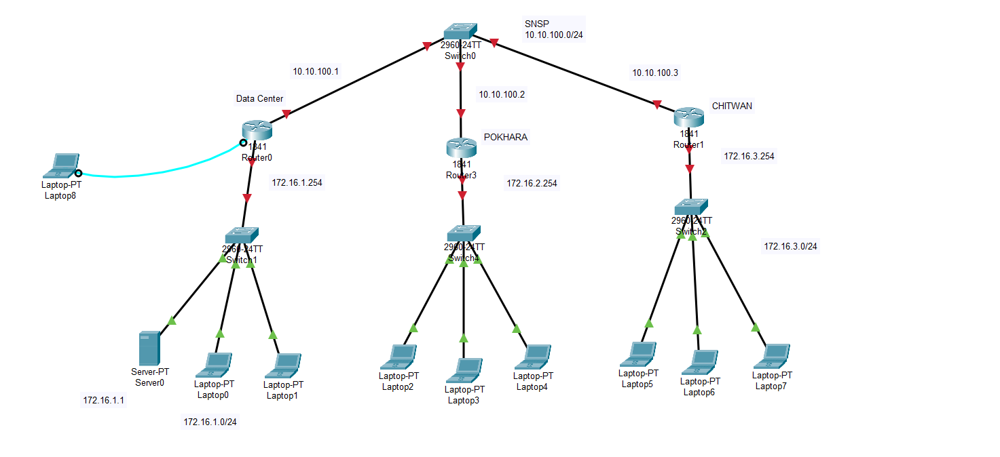

# Cisco Enterprise Routing Architecture

## Overview
This document describes an enterprise routing topology implemented in Cisco Packet Tracer with multiple interconnected subnets and routing protocols.

## Network Architecture

## Network Topology

### Core Layer
- **Router (Core)**: Central routing hub connecting all major network segments
    - Manages traffic between data center, branch offices, and remote sites
    - Implements routing policies and security controls
    - Provides redundancy and failover mechanisms

### Distribution Layer
- **Router 1 (S-IT)**: Connects Server farm and IT infrastructure
    - Handles data center traffic and backup operations
- **Router 2 (Router2)**: Manages branch office connectivity
    - Supports remote user access and VPN tunnels
- **Router 3 (S-GIS)**: Handles specialized network segments
    - Manages isolated departmental networks

### Access Layer
- **Multiple Switches (S-IT, S-GIS, etc.)**: Connect end devices
- **Laptops/PCs**: End-user devices across locations
- **Servers**: Database and application servers
- **Printer**: Network printer resource

## Network Connections

| Layer | Device | Purpose |
|-------|--------|---------|
| Core | Router-HQ | Enterprise backbone |
| Distribution | S-IT, Router2, S-GIS | Regional connectivity |
| Access | Switches | End-device connectivity |

## Routing Configuration

### Routing Protocol
- **Static Routing**: For simple, predictable routes
- **Dynamic Routing**: OSPF or EIGRP for scalability and automatic failover
- **Route Summarization**: Reduces routing table size

### Key Routing Features
- Load balancing across multiple paths
- Automatic convergence on network failures
- Redistribution between routing protocols if needed

## IP Addressing Scheme
- Plan subnets for each branch office
- Document gateway IPs for each segment
- Reserve server addresses in data center subnet
- Implement consistent subnet masks (/24 or /25)

## Best Practices
- Monitor routing protocol convergence times
- Document all static routes and policies
- Test failover scenarios regularly
- Maintain backup routing paths

